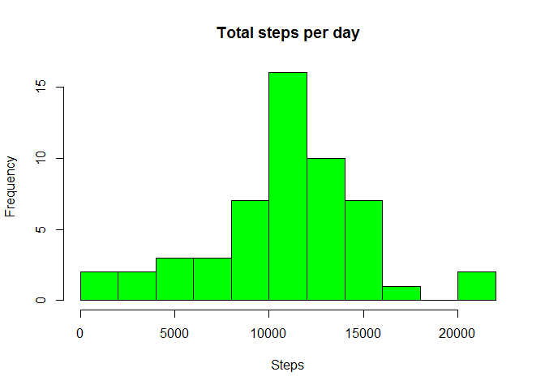
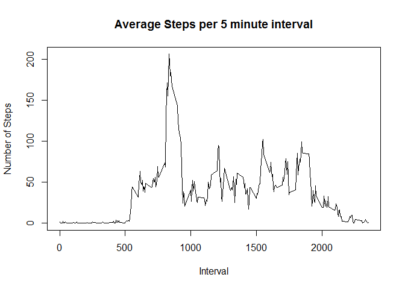
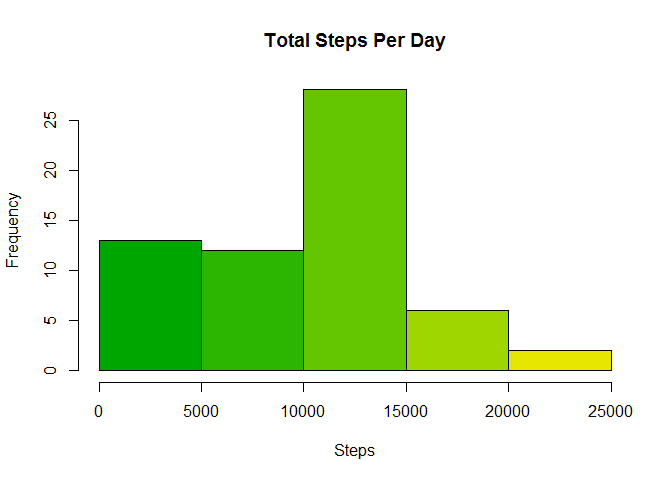
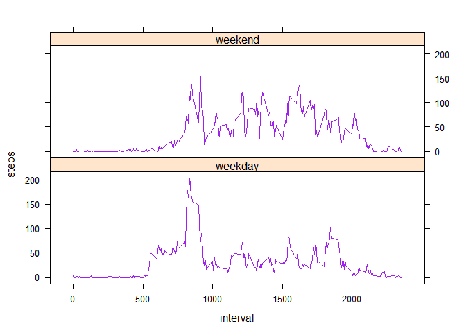

# PA1_template.Rmd
Jerry  
November 19, 2016  
# This is the R Markdown File for the Reproducible Research Course Project 1

The first Step is Reading and Processing the data

1. Code for reading the dataset and/or Processing the data

```r
raw_data <- read.csv("activity.csv")
```

2.Histogram of the total number of steps taken

```r
stepsperday <-aggregate(steps~date,data=raw_data,sum,na.rm=TRUE)
hist(stepsperday$steps,breaks=10,main ="Total steps per day",col="green",xlab="Steps")
```

<!-- -->

3. Mean and Median Number of steps taken each day

```r
data_mean <-mean(raw_data$steps,na.rm=TRUE)
data_median <-median(raw_data$steps,na.rm=TRUE)
```
The Mean number of steps taken each day is 37.3825996.
The Median number of steps taken each day is 0.

4.Time Series Plot of the average number of steps taken


```r
steps_interval <-aggregate(steps~interval,data=raw_data,mean,na.rm=TRUE)
plot(steps_interval$interval,steps_interval$steps, type="l",main="Average Steps per 5 minute interval",xlab="Interval", ylab="Number of Steps")
```

<!-- -->

5.The 5-minute interval that, on average, contains the maximum number of steps


```r
maxsteps <-max(steps_interval$steps)
```
The Maximum number of steps in the 5 minute interval was 206.1698113

6.Code to describe and show a strategy for imputing missing data
&
7.Histogram of the total number of steps taken each day after missing values are imputed


a) Calculating the number of missing values


```r
miss_data <- sum(is.na(raw_data$steps))
```
The Number of missing data points is 2304

b) Replace the missing values by mean and creating the histogram

```r
processed_data <-raw_data
processed_data$steps[is.na(processed_data$steps)]<-median(raw_data$steps,na.rm=TRUE)
processed_data_day <-aggregate(steps~date,data=processed_data,sum,na.rm=TRUE)
hist(processed_data_day$steps,col=terrain.colors(11),main="Total Steps Per Day",xlab="Steps",ylab="Frequency")
```

<!-- -->

c) calculating the median and mean

```r
data_mean_new <-mean(processed_data$steps,na.rm=TRUE)
data_median_new <-median(processed_data$steps,na.rm=TRUE)
```
The New Mean number of steps taken each day is 32.4799636.
The New Median number of steps taken each day is 0.


8.Panel plot comparing the average number of steps taken per 5-minute interval across weekdays and weekends


```r
library(lattice)
processed_data$date <-as.Date(processed_data$date)
processed_data$dayname <-weekdays(processed_data$date)
processed_data$weekend <- as.factor(ifelse(processed_data$dayname == "Saturday" |
                      processed_data$dayname == "Sunday", "weekend", "weekday"))
data_map <- aggregate(steps ~interval+weekend,processed_data,mean)
xyplot(steps ~interval|factor(weekend),data=data_map,layout=c(1,2),type="l",col="purple")
```

<!-- -->

